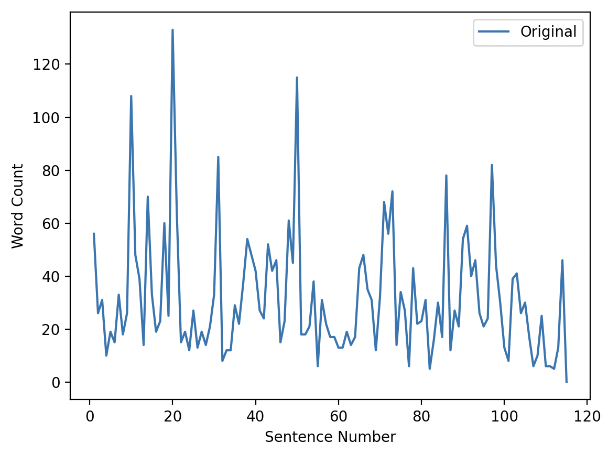
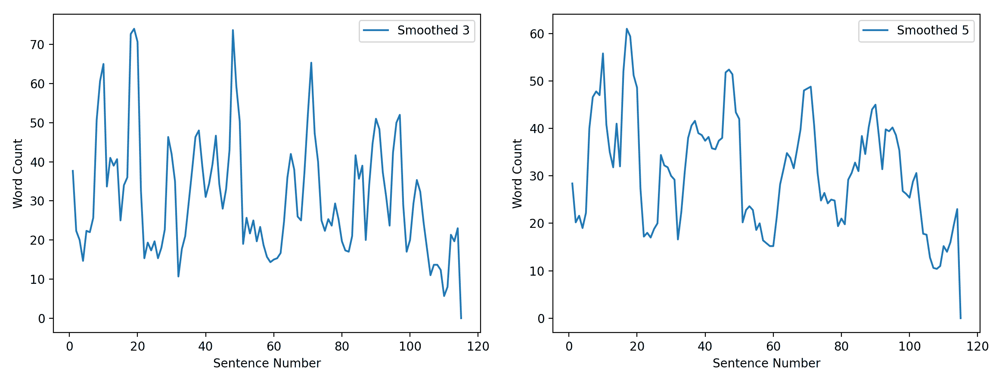

# Smoothing

Continuing the example from last lecture lets have a look of how we could smooth the volatile graph we aquired previously:



Lets discuss the smooth function given in the book:

```python
def smooth(data: list[float], width: int) -> list[float]:
    """Return a new list of data, smoothed over windows of the given width.
    Parameters:
    data: a list of numbers
    width: the width of each window
    Return value: a list of smoothed data values
    """
    total = 0                              # get sum for the first window

    for index in range(width):
        total = total + data[index]

    smoothed_data = [total / width]

    for index in range(1, len(data)):               # start at index 1
        total = total - data[index - 1]             # subtract left value

        if index + width - 1 < len(data):           # and, if possible,
            total = total + data[index + width - 1] # add right value
        width = min(width, len(data) - index)       # adjust width at end
        smoothed_data.append(total / width)         # append the mean

    return smoothed_data
```

We can now use it in our existing program from last lecture:

```python
def main()
    # ...

    senLen = []
    for s in sentenceList:
        wordList = s.split()
        senLen.append(len(wordList))

    # Insert the following:

    smoothed3 = smooth(senLen, 3)
    smoothed5 = smooth(senLen, 5)

    # Comment out the plots that you don't need
    pyplot.plot(range(1, len(senLen) + 1), senLen, label="Original")
    pyplot.plot(range(1, len(senLen) + 1), smoothed3, label="Smoothed 3")
    pyplot.plot(range(1, len(senLen) + 1), smoothed5, label="Smoothed 5")

    # ...
```

And we can see the following smoothed graphs:



## Algorithm Efficiency

We express an algorithm's efficiency in **Big-O notation** such as `O(1)` or `O(n)`.

Generally, we talk about 7 common levels of complexity in the following order, from most efficient to least efficient:

- `O(1)` **Constant Time.**
  _The complexity does not change with the input size._

- `O(log n)` **Logarithmic Time.**
  _Increasing the input size increases the work only slightly. Common in algorithms that repeatedly divide the problem in half, such as binary search._

- `O(n)` **Linear Time.**
  _The work grows directly in proportion to the input size._

- `O(n log n)` **Linearithmic Time.**
  _Slightly worse than linear time. Common in efficient sorting algorithms like merge sort, heap sort, and average-case quicksort._

- `O(n^2)` **Quadratic Time.**
  _The work grows with the square of the input size. Common when every item is compared with every other item._

- `O(2^n)` **Exponential Time.**
  _The work doubles with each additional input element. Often appears in brute-force recursive solutions._

- `O(n!)` **Factorial Time.**
  _The work grows extremely fast. Common in algorithms that generate all possible permutations._

## Approximate Iterations for `n = 1000`

These are rough values to help build intuition. Actual runtime depends on constants, hardware, and implementation details.

| Big-O        | Name         | Approximate iterations when `n = 1000` | Example                             |
| ------------ | ------------ | -------------------------------------: | ----------------------------------- |
| `O(1)`       | Constant     |                                      1 | Accessing an array element by index |
| `O(log n)`   | Logarithmic  |                                    ~10 | Binary search                       |
| `O(n)`       | Linear       |                                  1,000 | Single loop through an array        |
| `O(n log n)` | Linearithmic |                                ~10,000 | Merge sort                          |
| `O(n^2)`     | Quadratic    |                              1,000,000 | Nested loops over the same array    |
| `O(2^n)`     | Exponential  |            ~`2^1000` ≈ `1.07 × 10^301` | Recursive subset generation         |
| `O(n!)`      | Factorial    |                                `1000!` | Generating all permutations         |

## Notes

- For `O(log n)`, the exact number depends on the logarithm base, but in computer science it is often base 2.
  For `n = 1000`, `log2(1000) ≈ 9.97`, so we usually say about **10 iterations**.

- For `O(n log n)`, using base 2:
  `1000 × log2(1000) ≈ 1000 × 10 = 10,000`

- `O(2^n)` and `O(n!)` become impractical very quickly, even for relatively small inputs.

## Rule of Thumb

As `n` grows large:

`O(1) < O(log n) < O(n) < O(n log n) < O(n^2) < O(2^n) < O(n!)`

This is why algorithms with `O(n log n)` or better are usually preferred for large datasets.

## Examples

#### `O(1)` Constant Time Complexity

Most operations are constant time, such as:

- variable assignments
- arithmetic and comparison operators
- print

Even if we have thousands of those, the algorithm efficiency is not dependent on the input size `n`, thus stays constant.

```python
# O(1)
def doThis6(n):
    print(n)
```

#### `O(n)` Linear Time Complexity

For loops (using n) are the classical example for linear time complexity:

```python
# O(n)
def doThis1(n):
    for i in range(n):

        print(i)
```

Not all loops contribute to O.
In the loop below the inner loop runs a specific amount of iterations, thus the inner loop is not dependent on the input size and should be ignored (treated as constant time):

```python
# T(10) -> 10 * 10
# O(n)
def doThis5(n):
    for i in n:
        for j in range(10):
            print(i, j)
```

#### `O(n^2)` Quadratic Time Complexity

Nested loops fall under this category.

```python
# O(n^2)
def doThis2(n):
    for i in range(n):
        for j in range(n):
            print(i, j)
```

Notice that only the most significant factors contribute to `O`.
In the example below the first loop is ignored, as it matters less and less the larger n becomes in comparison to the nested loop below:

```python
# T(10) => 1 + 10 + 10 * 10
# O(n^2)
def doThis3(n):
    x = 0

    for i in range(n):
        print(i)

    for i in range(n):
        for j in range(n):
            print(i, j)
```

We may also have O dependent on two factors (`n` and `m`):

```python
# O(n*m)
def doThis4(n, m):
    for i in n:
        for j in m:
            print(i, j)
```

## Analyzing an algorithm

Lets analze our smooth function:

```python
def smooth(data: list[float], width: int) -> list[float]:
    """Return a new list of data, smoothed over windows of the given width.
    Parameters:
    data: a list of numbers
    width: the width of each window
    Return value: a list of smoothed data values
    """
    total = 0                              # get sum for the first window

    for index in range(width):
        total = total + data[index]

    smoothed_data = [total / width]

    for index in range(1, len(data)):               # start at index 1
        total = total - data[index - 1]             # subtract left value

        if index + width - 1 < len(data):           # and, if possible,
            total = total + data[index + width - 1] # add right value
        width = min(width, len(data) - index)       # adjust width at end
        smoothed_data.append(total / width)         # append the mean

    return smoothed_data
```

Key piece of info:

```python
smoothed_data.append(total / width)
```

We can't determine the algorith complexity unless we know the time complexity of all library functions that are called.

During an exam I will give you info that for example the `append()` method is `O(1)`, thus you can determine the overall time complexity of `O(n)`

### Best Case vs Average Case vs Worst Case

Not always does an algorithm run with the same time complexity.
For example when sorting a nearly sorted list we might only have to swap a few entries, while when sorting a reverse list we need to swap everything.

Even the append function doesnt consistenlty take `O(1)` time. This is usually the case (also called amortizised time complexity) but occationally the list will have to be rebuild which takes `O(n)`. We are talking about the worst-case here.

Unless otherwise mentioned when we talk about `O()` we typically refer to the **worst-case** time complexity.
