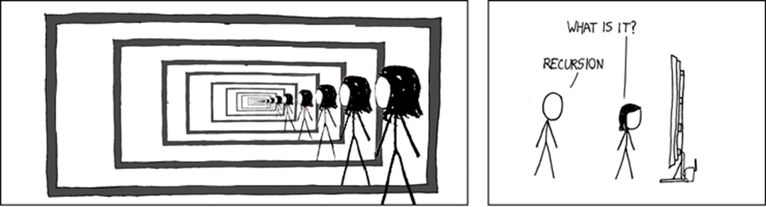
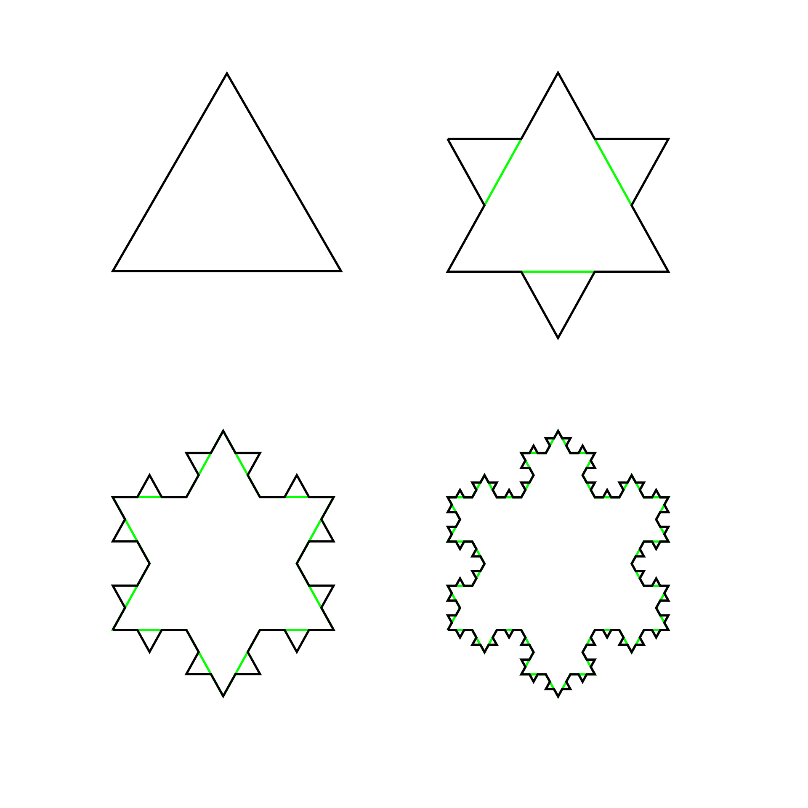
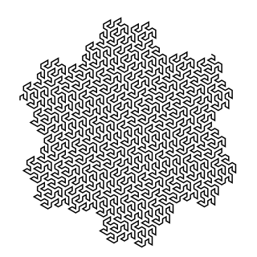

# Fractals

Before we learn the basics and rules of recursion (on Wednesday) we will look at some interesting graphics that are produced by this very concept.



To simplify things we will first learn about a system to define and write recursive functions:

## Lindenmayr System



Fractals are often represented in the Lindenmayr System. For example, the **Koch Snowflake** can be described like this:

```
K(N) = K' ++ K' ++ K'
K'(0) = F
K'(N) = K' - K' ++ K' - K'
```

`K` represents the main function.

`K'` represents the helper function, where `K(0)` are instructions for the base case and `K'(N)` for recursive cases.

`N` represents the depth, and needs to be an a positive integer or `0`. The higher the number, the more detailed our structure becomes. Careful, making this number too high often results in our program not completing in time / at all. Recursion can be expensive!

There are only three types of movements that we can all simulate with Turtle graphics:

- `F` Move forward
- `+` Turn right 60 degrees
- `-` Turn left 60 degrees

`++` would therefore mean turn right 120 degrees.

Let us implement Koch via Lindenmayr by defining both functions first:

```python
def Koch(n, length):
  # K' ++ K' ++ K'
  pass

def KochHelper(t, n, length):
  if n == 0:
    # F
    pass
  else:
    # K' - K' ++ K' - K'
    pass
```

Using turtle graphics we might end up with the following main function:

```python
import turtle

def Koch(n, length):
  t = turtle.Turtle()

  # K' ++ K' ++ K'
  KochHelper(t, n, length)
  t.right(120)
  KochHelper(t, n, length)
  r.right(120)
  KochHelper(t, n, length)
```

We could have also defined the turtle as a global variable.We still need to impement the helper function:

```python
def KochHelper(t, n, length):
  if n == 0:
    # F
    t.forward(length)
  else:
    # K' - K' ++ K' - K'
    KochHelper(t, n-1, length/3)
    t.left(60)
    KochHelper(t, n-1, length/3)
    t.right(120)
    KochHelper(t, n-1, length/3)
    t.left(60)
    KochHelper(t, n-1, length/3)
```

We can specify the size (length) and level of detail (n) when we finally call the main function:

```python
Koch(2, 200)
```

Please find the entire program under `snowflake.py`.

## Gosper Curve

**Activity**: Draw the follwing fractal at level 3 using the Lindenmayer rules learned above:

```
G(0) = F
G(N) = G - G' -- G' + G ++ GG + G' -
G'(0) = F
G'(N) = + G - G'G' -- G' - G ++ G + G'
```


