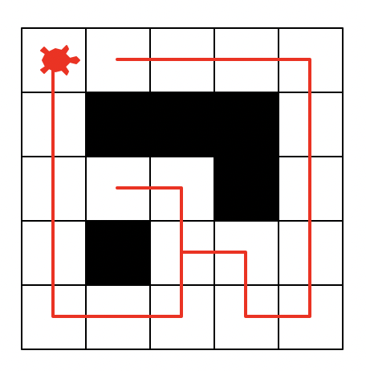

# Recursion Practice Examples:

Complete the following functions to practice recursion.
All these examples (in this length and complexity) could be featured in the final exam.

## isPalindrome(string)

A palindrome is a string that can be read from left to right and right to left without it being read differently. See tests below to see valid Palindromes.

```python
def isPalindrome(string):
  # TODO
  pass

# tests
assert isPalindrome("")
assert isPalindrome("A")
assert isPalindrome("Aa") == False
assert isPalindrome("AB") == False
assert isPalindrome("ABA")
assert isPalindrome("ABBA")
```

## buildPalindrome(string)

We can also recursively build a palindrome:

```python
def buildPalindrome(string):
  # TODO
  pass

# tests
assert buildPalindrome("") == ""
assert buildPalindrome("A") == "AA"
assert buildPalindrome("AB") == "ABBA"
```

## count(string, character)

Recursively count the number of occurences of `character` in `string`.
Note that this function has a recursive helper function to minimize the number of parameters in the main function.

```python
def count(string, character):
  return countHelper(0, string, substring)

def countHelper(count, string, character)
  # TODO
  pass

# tests
assert count("ABBA", "A") == 2
assert count("ABBA", "AB") == 1
assert count("ABBA", "BB") == 0
```

## Recursive Spiral

Recursively draw a spiral in Turtle that gets bigger (until the length of the side reaches `max_length` pixel)

```python
import turtle

g = turtle.Turtle()

def spiral(t, increment, max_length):
  # TODO

# tests
spiral(g, 5, 120)
```

After coding this example reflect:

- What is the base case in your function?
- What is the recursive case in your function?

## Harder Example

Not featured on test but shows another good application of recursion.

Given a set of characters generate all possible passwords from them. This means we should generate all possible permutations of words using the given characters, with repetitions and also upto a given length.

_We will do this together._

### Examples

```
Input : ['a', 'b']
Output : a b aa ab ba bb
```

The solution is to use recursion on the given character array. The idea is to pass all possible lengths and an empty string initially to a helper function. In the helper function we keep appending all the characters one by one to the current string and recur to fill the remaining string till the desired length is reached.
It can be better visualized using the below recursion tree:

```
        (a, b)
         /   \
        a     b
       / \   / \
      aa  ab ba bb
```

```python
# Recursive helper function, adds/removes characters until len is reached
def generate(letters, i, s, len):
  # TODO

# function to generate all possible passwords
def crack(letters):
    # call for all required lengths
    for i in range(1 , len(letters) + 1):
        generate(letters, i, "", len(letters))

# Driver Code
letters = ['a', 'b', 'c' ]
crack(letters)
```

# 204 Preview

Depth First Search



We can recursively find a path in a maze by taking a step and backtracking if that step lead to a dead end.

We set up a maze via a nested list:
```python
# 1 = open path, 0 = wall
grid = [
    [1, 1, 1, 1, 1],
    [1, 0, 0, 0, 1],   # wall in the middle
    [1, 1, 1, 0, 1],
    [1, 0, 1, 1, 1],
    [1, 1, 1, 1, 1]
]
```

We do this by marking visited cells and keeping track of the path we took:

- Explore an adjacent unvisted cell
  - check if it is the final destination if so done!
  - if not, repeat
- if no adjacent unvistited cells backtrack until i can explore an adjacent unvistited cell again.
  - if we end up at the start position again (no adjacent unvisited cells from here) there is no path to the final destination.

Please see the code under `dfs.py`. Run it in IDLE!

The implementation currently doesn't look for a final destination but explores all paths that can be taken from the starting coordinate.

### Challenge
Create `dfs2.py` which takes in an additional parameter (`destination`) which is a tuple in the format `(x, y)`. If the algorithm encounters the final destination it should immediately stop and draw the path to it. This is guaranteed to be the shortest path! :)
